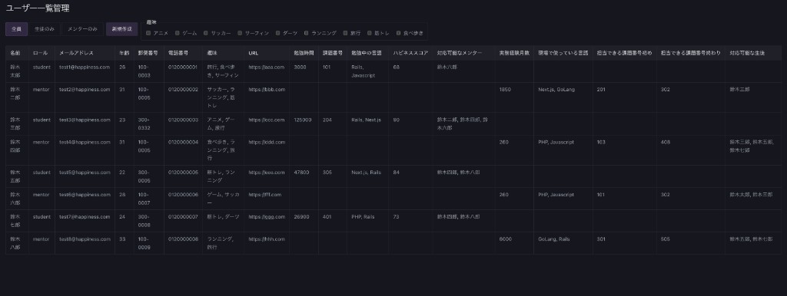
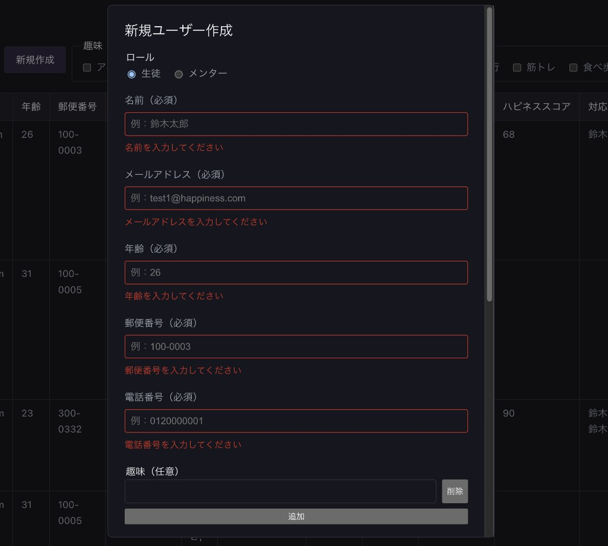

# 生徒・メンター管理ダッシュボード

**デモ**: https://（Vercel デプロイ後に記入）

React + TypeScript の実践学習の一環として、生徒とメンターの情報を一覧・絞り込み・追加できる管理画面を作成しました。1周目の実装を振り返り、型設計や構成に改善余地を感じたため、仕様書・設計書を整えてから作り直しています。

## スクリーンショット

### 一覧画面



### 新規作成フォーム（バリデーションエラー）



## 主な機能

- 全員 / 生徒 / メンターのタブ切り替え
- テーブルヘッダークリックによる並び替え（昇順 / 降順 / 解除）
- 趣味・言語のチェックボックス複数選択による絞り込み
- 新規ユーザー作成（バリデーション付き）
- 課題番号に基づくメンター ↔ 生徒の対応関係表示

## 技術スタック

- React 19
- TypeScript
- Vite
- ESLint

## 背景

React + TypeScript の UI 実装を深く理解するため、同テーマの管理画面の設計・実装に取り組みました。最初の版（https://github.com/Kenichi585-sys/react-typescript-introduction）
では型の扱いやファイル構成に課題があったため、改善点を整理し、[SPEC.md](./SPEC.md) と [DESIGN.md](./DESIGN.md) を作成したうえで、AI との ペアプログラミング を通じて再実装しています。

## 設計上のポイント

- 生徒とメンターで属性が異なるため、`Student | Mentor` の判別可能 Union 型で型安全に設計
- ソート・フィルタ・マッチング・バリデーションを `utils/` に分離し、`App.tsx` は state 管理と表示用リストの組み立てに集中
- フォームの入力 state は `UserForm` 内に閉じ、送信時のみ親に渡す
- モーダル（`UserFormModal`）とフォーム本体（`UserForm`）、リスト入力（`ListField`）を責務ごとに分割

## 設計ドキュメント

- [仕様書（SPEC.md）](./SPEC.md)
- [設計書（DESIGN.md）](./DESIGN.md)

## セットアップ

```bash
git clone git@github.com:Kenichi585-sys/react-typescript-introduction-2.git
cd react-typescript-introduction-2
npm install
npm run dev
```

## 利用可能な npm scripts

| コマンド          | 説明               |
| ----------------- | ------------------ |
| `npm run dev`     | 開発サーバーを起動 |
| `npm run build`   | 本番ビルド         |
| `npm run preview` | ビルド結果の確認   |
| `npm run lint`    | ESLint を実行      |

## ディレクトリ構成

```
src/
├── components/   # Toolbar, UserTable, TableHeader, UserFormModal, UserForm, ListField
├── utils/        # filter, sort, match, validation
├── types.ts      # 型定義（Student / Mentor の判別可能 Union 型など）
├── data.ts       # 初期データ（モック）
├── App.tsx       # 状態管理・表示用リストの計算
└── index.css     # スタイル
```
